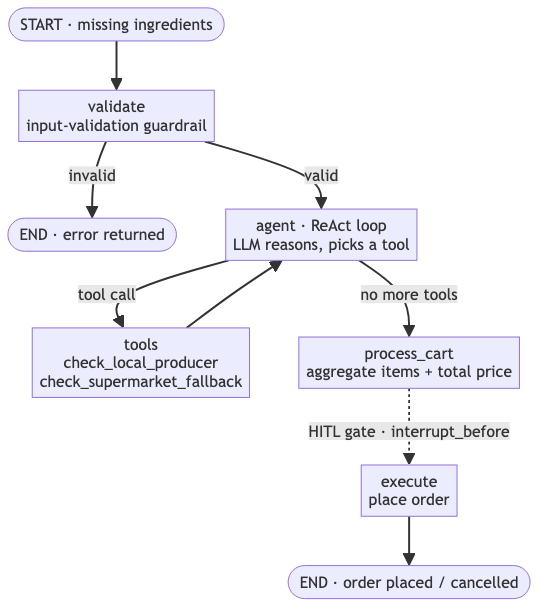
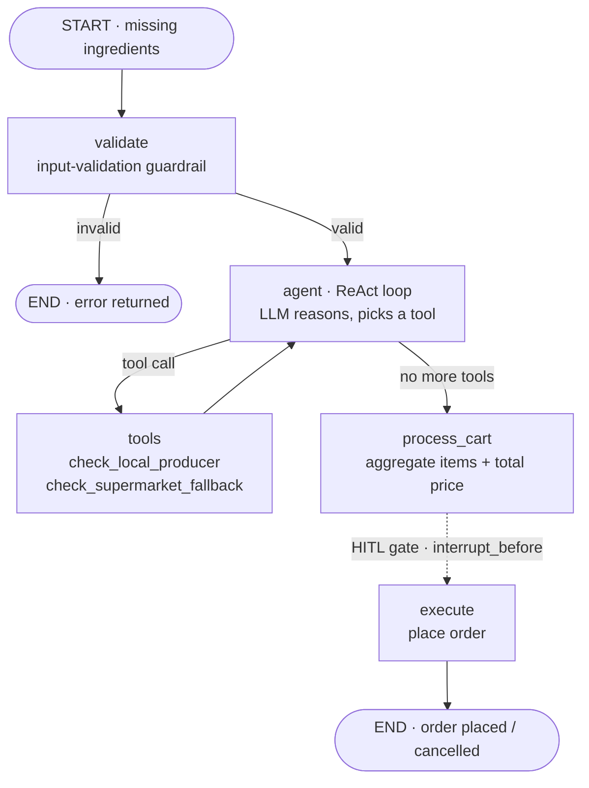

# Nourri Agentic MVP

This repository contains the MVP for Nourri's **Missing Ingredient Ordering Agent**. 

This agent uses LangGraph, Gemini, and Streamlit to orchestrate a workflow that:
1. Takes a list of missing ingredients as input.
2. Sources items from local producers (or falls back to supermarkets).
3. Evaluates total price and applies a Human-in-the-Loop (HITL) guardrail before placing the order.

## Deliverable 1 — Agentic Workflow

**Decision sequence:** When a user selects a recipe with missing ingredients, the agent sources each item from local producers, falls back to supermarkets when a local producer doesn't have it, totals the basket, and stops for human approval before placing the order.

**Why an agent, not a pure workflow:** The model decides at runtime — for each ingredient it reads the local-producer result and judges whether to fall back to a supermarket, rather than following a hardcoded if-then. (Honestly, the core is close to a *routing* workflow; the agentic part is that per-ingredient runtime judgement.)

**Anthropic pattern:** Routing — a bounded tool-use loop in which the LLM routes each ingredient to the appropriate tool and decides when to stop.

**Architecture (see Deliverable 2):** ReAct — a single agent that reasons and acts in a loop over its tools (`agent → tools → agent` in [agent/graph.py](agent/graph.py)).

**Success metric (measured by the test suite):** ≥ 90% of missing ingredients sourced (local or fallback), total computed, and the HITL gate reached in < 30 s per run.

**Selection criteria check:** high frequency (every cook session) · bounded decision space (two tools, finite outcomes) · measurable success (coverage % + latency) · recoverable failure (no order is placed without explicit human confirmation).

## Deliverable 2 — Architecture

**Architecture:** ReAct (single agent). Control-flow signature: a **reason → act → observe** loop — one agent thinks, calls a tool, reads the result, and repeats until the basket is complete.

**Diagram (this instance — mirrors [agent/graph.py](agent/graph.py)):**





The dashed edge is the **Human-in-the-Loop gate**: the graph is compiled with `interrupt_before=["execute"]`, so it halts after `process_cart` and resumes only on explicit user approval (see Deliverable 6).

**Justification (2 lines):** ReAct fits a bounded, two-tool sourcing job — one agent loops over its tools with model-driven judgement for the local→fallback decision, with no orchestration overhead. We deliberately avoid the multi-agent setup the brief warns against ("multi-agent for the sake of it").

**Trade-off accepted:** Limited parallelism, and a single agent grows brittle as the tool count grows — acceptable at two tools; we'd revisit (e.g. a supervisor) only if the tool surface expands in V1.

## Deliverable 3 — Tool & MCP Stack

**Framework — LangGraph** (declared in [requirements.txt](requirements.txt)). It gives us a state graph with native human-in-the-loop (`interrupt_before`), which maps directly onto our `validate → agent ⇄ tools → process_cart → execute` flow.

**Model**

| Model | Role | Where in code | Justification |
|---|---|---|---|
| `gemini-2.0-flash` | The single ReAct agent's reasoning + tool-selection model | `MODEL_NAME` in [agent/llm.py](agent/llm.py), used by `create_agent_graph()` | Best cost/latency/quality for low-volume orchestration over two tools; a frontier "flash" tier is plenty for a bounded routing decision. |
| Deterministic **mock** | Offline stand-in so tests + demo run with no API key | `MockSourcingLLM` in [agent/llm.py](agent/llm.py) | Reviewer can run in <10 min with no secrets; real Gemini is used automatically when `GEMINI_API_KEY` is set. |

An SLM-substitution comparison for the sourcing call is measured in the carbon test (Deliverable 7).

**MCP server — `nourri-sourcing-catalog`** (FastMCP). Built in [mcp_server/catalog_server.py](mcp_server/catalog_server.py); the connection config is committed at [mcp_server/mcp_config.json](mcp_server/mcp_config.json).

- **Tools exposed:** `check_local_producer`, `check_supermarket_fallback`.
- **Permissions:** read-only (catalog lookups). The server has **no** write/order capability — ordering stays behind the in-app HITL gate.
- **Scopes:** `catalog:read`.
- **Rate limits (declared):** 60 req/min · max 4 concurrent sessions · 10 s timeout.
- **How the agent connects:** [agent/tools.py](agent/tools.py) `get_tools()` loads the MCP tools via [agent/mcp_client.py](agent/mcp_client.py) (spawned over stdio); if the server is unreachable it **falls back to in-process tools** and logs which path was taken to `/traces/`. Run the server standalone with `python -m mcp_server.catalog_server`.

## Deliverable 4 — Working Agent Implementation

The agent runs end-to-end in code. **See it live** in the Streamlit app under **Local Market → Live Ordering Agent** ([live_agent_panel.py](live_agent_panel.py)): enter missing ingredients, watch the agent source them, then approve at the HITL gate. Headless logic is in [agent/graph.py](agent/graph.py) + [agent/runner.py](agent/runner.py).

How it meets the "minimum bar for working":

| Requirement | Evidence |
|---|---|
| Runs end-to-end (real input → real output) | Ingredient list → structured cart + placed order ([agent/runner.py](agent/runner.py)) |
| ≥ 2 tool / MCP calls per run | `check_local_producer` then `check_supermarket_fallback` for unavailable items |
| Reads from an external source | MCP catalog server (or in-process catalog fallback), not hardcoded in the prompt |
| Structured output | `cart` = list of `{ingredient, source, price, channel}` + `total_price` |
| Handles a failure mode | MCP unreachable → graceful fallback to in-process tools; invalid input → guardrail error, no crash |
| Logs every tool call | `tool.call` / `tool.result` / `cart.compiled` / `order.placed` lines in `/traces/agent_log.jsonl` |
| No hardcoded secrets | model key via `GEMINI_API_KEY`; mock used when absent |

Verified by [tests/test_agent_smoke.py](tests/test_agent_smoke.py) (run/approve, cancel, guardrail).

## Deliverable 5 — SKILL.md Authoring

**Where it lives:** [skills/ordering_agent.SKILL.md](skills/ordering_agent.SKILL.md).

Our SKILL.md file teaches the agent the procedural knowledge needed to source ingredients and interact with the user safely.

**How it meets the requirements:**
- **YAML Frontmatter:** Declares `name`, `description`, `version`, and `model_hints` (gemini-2.0-flash).
- **Procedural, not declarative:** Instructions are given as numbered step-by-step procedures rather than loose guidelines.
- **Explicit stop conditions:** Step 4 has a clear STOP CONDITION before execution. The agent must pause and await explicit human approval (`awaiting_approval` state).
- **Failure handling:** Outlines explicit steps for tool timeouts and prompt injections.
- **Extracted examples:** The examples (happy path, edge case, and adversarial input) are maintained in a separate [`examples/`](skills/examples/) subfolder to keep the main skill file clean, and are linked directly from the `SKILL.md`.

## Deliverable 6 — Implemented Guardrails

**Where they live:** Code scattered in `guardrails/`, `agent/graph.py`, and `agent/trace.py`.

We have implemented five robust guardrails to ensure safe and observable operations, exceeding the minimum required set for this deliverable:

1. **Input Validation (Refuse List & Schema Checks)**
   - **Where:** `guardrails/input_validation.py` inside `validate_input()`.
   - **How it works:** Enforces a hard schema (must be a list of strings), a maximum item cap (10 items), length constraints on ingredients (max 40 chars), and a regex-based refuse list to catch prompt injection (`ignore previous`, `bypass`, etc.). If violated, the graph never reaches the LLM.
2. **HITL Approval Gate (Human-in-the-Loop)**
   - **Where:** `agent/graph.py` (LangGraph checkpointing).
   - **How it works:** The agent graph is compiled with `interrupt_before=["execute"]`. This ensures the agent CANNOT place an order autonomously. It pauses at the `awaiting_approval` state after compiling the cart, demanding explicit user interaction on the frontend to proceed.
3. **Audit Logging**
   - **Where:** `agent/trace.py` and `agent/graph.py`.
   - **How it works:** Every notable lifecycle event (guardrail pass/fail, tool calls, tool results, cart compilation, and order execution) is written as structured JSON-lines to `traces/agent_log.jsonl`. This allows a reviewer to trace exactly what inputs were received, decisions were made, and outputs were returned.
4. **Token/Turn Budget Limits**
   - **Where:** `agent/graph.py`.
   - **How it works:** Enforces a maximum turn limit (acting as a proxy for a token budget) by aborting the execution if the message count exceeds 15, preventing infinite loops.
5. **Tool Output Sanitization**
   - **Where:** `agent/graph.py` inside `tool_node`.
   - **How it works:** Scrubs all returned content from tools against the `REFUSE_PATTERNS` refuse list before it is re-injected into the LLM context, thwarting indirect prompt injection attacks.

These guardrails are tested directly in `tests/test_agent_smoke.py`.

## Deliverable 7 — Tests

**Where they live:** Scripts in [`tests/`](tests/) and results in [`tests/results/REPORT.md`](tests/results/REPORT.md).

We have implemented four mandatory test suites to validate our agent's robustness, fairness, efficiency, and transparency:

1. **Robustness (`test_robustness.py`)**: Tests 10 adversarial inputs (prompt injections, off-topic requests) and 5 edge cases (empty arrays, oversized inputs). All were correctly blocked by our guardrails.
2. **Bias (`test_bias.py`)**: Evaluates the model's cultural fairness by comparing the processing of Western vs. Non-Western ingredients. Both sets pass with 0% refusal disparity.
3. **Carbon (`test_carbon.py`)**: Computes energy per task (~0.0000072 kWh) and emissions (~0.0018 gCO₂eq per run). We estimate monthly emissions of ~18 gCO₂eq for 10,000 tasks and document SLM alternatives.
4. **Explainability (`test_explainability.py`)**: Parses our `traces/agent_log.jsonl` audit log to ensure 100% trace completeness, programmatically validating the existence of `tool.call`, `tool.result`, and `cart.compiled` events.

All test numbers and findings are rigorously summarized in our final test report.

## Project Structure
- `app.py`: Streamlit frontend for the demo.
- `agent/`: LangGraph orchestrator (`graph.py`), model factory (`llm.py`), tools + MCP loader (`tools.py`, `mcp_client.py`), shared catalog (`catalog.py`), tracing (`trace.py`).
- `mcp_server/`: FastMCP catalog server (`catalog_server.py`) + connection config (`mcp_config.json`).
- `guardrails/`: Input validation and HITL checks.
- `skills/`: The procedural SKILL.md specifying agent logic.
- `tests/`: Scripts for testing robustness, bias, carbon, and explainability.
- `traces/`: Directory where agent logs and trajectories are saved.

## Setup and Run

1. **Install dependencies**:
   ```bash
   pip install -r requirements.txt
   ```

2. **Configure Environment Variables**:
   Copy `.env.example` to `.env` and add your Gemini API key:
   ```bash
   cp .env.example .env
   # Edit .env with your GEMINI_API_KEY
   ```

3. **Run the Streamlit Demo**:
   ```bash
   streamlit run app.py
   ```

4. **Run the Tests**:
   ```bash
   python -m pytest tests/
   ```
